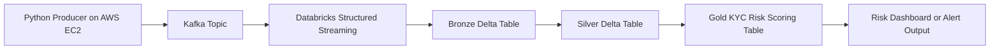

# KYC Streaming Data Pipeline

This project is a simulated KYC streaming data pipeline.

The goal of this project is to generate customer KYC data, send the data to Kafka, ingest the Kafka events into Databricks, and process the data through Bronze, Silver, and Gold layers to calculate customer risk scores.

---

## 1. Project Overview

This system simulates a real-time KYC data pipeline.

A Python producer script randomly generates customer profile data. The producer runs on an AWS EC2 instance and sends customer events to a Kafka topic.

Databricks reads the Kafka topic using Structured Streaming and stores the data into Delta Lake tables.

The data is processed through the following layers:

```text
Python Producer
    ↓
Kafka Topic
    ↓
Databricks Structured Streaming
    ↓
Bronze Layer: Raw Kafka Data
    ↓
Silver Layer: Cleaned Customer Data
    ↓
Gold Layer: KYC Risk Scoring Output
```

---

## 2. Architecture



---

## 3. Tech Stack

| Component          | Technology                                       |
| ------------------ | ------------------------------------------------ |
| Data Generator     | Python                                           |
| Streaming Platform | Apache Kafka                                     |
| Cloud Server       | AWS EC2                                          |
| Data Processing    | Databricks(Azure), PySpark, Structured Streaming |
| Storage Format     | Delta Lake                                       |
| Data Layers        | Bronze, Silver, Gold                             |
| Output             | KYC Risk Score Table                             |

---

## 4. Data Flow

### 4.1 Python Producer

The Python producer randomly generates customer KYC data.

The producer is responsible for:

- Generating random customer profile records
- Creating Kafka event metadata
- Sending JSON messages to Kafka
- Using `user_id` as the Kafka message key

The producer only generates data while the Python script is running.

---

### 4.2 Kafka

Kafka is used as the streaming message broker.

The producer sends customer profile events to the following Kafka topic:

```text
kyc.customer.profile.raw.v1
```

---

### 4.3 Databricks Consumer

Databricks reads messages from Kafka using Structured Streaming.

The raw Kafka messages are first stored in the Bronze layer. Then Databricks jobs clean, transform, and enrich the data into the Silver and Gold layers.

---

## 5. Delta Lake Layer Design

### 5.1 Bronze Layer

The Bronze layer stores raw Kafka messages with minimal transformation.

Example table:

```text
bronze_kyc_customer_profile_raw
```

The Bronze table stores:

| Column           | Description                    |
| ---------------- | ------------------------------ |
| `topic`          | Kafka topic name               |
| `partition`      | Kafka partition number         |
| `offset`         | Kafka message offset           |
| `key`            | Kafka message key              |
| `value`          | Raw Kafka message value        |
| `timestamp`      | Kafka message timestamp        |
| `ingestion_time` | Databricks ingestion timestamp |

The purpose of the Bronze layer is to keep the original source data for replay, audit, and debugging.

---

### 5.2 Silver Layer

The Silver layer stores cleaned and standardized customer profile data.

Example table:

```text
silver_kyc_customer_profile
```

The Silver layer is responsible for:

- Parsing JSON messages
- Validating required fields
- Standardizing column names
- Converting data types
- Removing duplicated events
- Standardizing `Y` and `N` flag values
- Flattening important fields from the Kafka payload

---

### 5.3 Gold Layer

The Gold layer stores business-ready KYC risk scoring results.

Example table:

```text
gold_kyc_customer_risk_score
```

The Gold layer calculates customer risk scores based on KYC business rules.

---

## 6. Customer Data Schema

The customer profile data contains customer identity information, source system information, account information, and risk-related attributes.

| Field Name              | Data Type | Example                                     | Description                                                               |
| ----------------------- | --------- | ------------------------------------------- | ------------------------------------------------------------------------- |
| `user_id`               | string    | `USR100001`                                 | Unique customer ID                                                        |
| `user_address`          | string    | `100 King Street West, Toronto, ON, Canada` | Customer address                                                          |
| `user_job`              | string    | `Software Engineer`                         | Customer occupation                                                       |
| `user_account_types`    | array     | `["CHECKING", "SAVINGS"]`                   | List of account types owned by the customer                               |
| `user_jurisdiction`     | string    | `CA-ON`                                     | Customer jurisdiction                                                     |
| `risk_flag`             | string    | `Y` or `N`                                  | Indicates whether the customer is high risk based on a third-party system |
| `pep_flag`              | string    | `Y` or `N`                                  | Indicates whether the customer is a Politically Exposed Person            |
| `source_system`         | string    | `TD_BANK`                                   | Source system that provides the customer data                             |
| `user_country`          | string    | `CANADA`                                    | Customer country                                                          |
| `user_account_channel`  | string    | `ONLINE` or `BRANCH`                        | Channel used to open the account                                          |
| `user_last_review_time` | timestamp | `2025-12-01T10:30:00Z`                      | Last KYC review time                                                      |
| `user_accounts`         | array     | See sample message                          | List of customer accounts                                                 |

---

## 7. Sample Values for Data Generator

### 7.1 User Jobs

```python
USER_JOBS = [
    "Software Engineer",
    "Data Analyst",
    "Business Owner",
    "Doctor",
    "Lawyer",
    "Real Estate Agent",
    "Accountant",
    "Student",
    "Consultant",
    "Cashier"
]
```

### 7.2 User Countries

```python
USER_COUNTRIES = [
    "CANADA",
    "UNITED_STATES",
    "CHINA",
    "INDIA",
    "UNITED_KINGDOM",
    "MEXICO",
    "BRAZIL",
    "IRAN",
    "RUSSIA",
    "UNITED_ARAB_EMIRATES"
]
```

### 7.3 Source Systems

```python
SOURCE_SYSTEMS = [
    "TD_BANK",
    "RBC",
    "HSBC",
    "WEALTHSIMPLE",
    "AMERICAN_BANK"
]
```

### 7.4 Account Channels

```python
ACCOUNT_CHANNELS = [
    "ONLINE",
    "BRANCH"
]
```

### 7.5 Account Types

```python
ACCOUNT_TYPES = [
    "CHECKING",
    "SAVINGS",
    "CREDIT_CARD",
    "INVESTMENT",
    "MORTGAGE",
    "LOAN",
    "BUSINESS_ACCOUNT"
]
```

---

## 8. Kafka Topic Design

### 8.1 Topic Name

```text
kyc.customer.profile.raw.v1
```

This topic stores raw customer profile events.

The topic name follows this pattern:

```text
<domain>.<entity>.<event_category>.<data_stage>.<version>
```

Example:

```text
kyc.customer.profile.raw.v1
```

| Part           | Value      | Meaning                 |
| -------------- | ---------- | ----------------------- |
| Domain         | `kyc`      | KYC business domain     |
| Entity         | `customer` | Customer-related data   |
| Event Category | `profile`  | Customer profile event  |
| Data Stage     | `raw`      | Raw source event        |
| Version        | `v1`       | Version 1 of this topic |

---

### 8.2 Kafka Message Key

The Kafka message key is:

```text
user_id
```

Example:

```text
USR100001
```

Using `user_id` as the Kafka key helps Kafka send events for the same customer to the same partition. This is useful for preserving customer-level event ordering.

---

### 8.3 Kafka Message Value

The Kafka message value uses JSON format.

The message follows an event-envelope structure:

```json
{
  "event_id": "unique event id",
  "event_type": "event type",
  "event_time": "event created time",
  "source_system": "source system name",
  "schema_version": "1.0",
  "payload": {
    "business data goes here"
  }
}
```

---

## 9. Kafka Event Schema

### 9.1 Event Metadata

| Field Name       | Data Type | Example                    | Description                |
| ---------------- | --------- | -------------------------- | -------------------------- |
| `event_id`       | string    | `evt_20260615_000001`      | Unique event ID            |
| `event_type`     | string    | `CUSTOMER_PROFILE_CREATED` | Type of event              |
| `event_time`     | timestamp | `2026-06-15T14:30:00Z`     | Event creation time        |
| `source_system`  | string    | `TD_BANK`                  | Source system of the event |
| `schema_version` | string    | `1.0`                      | Schema version             |
| `payload`        | object    | `{...}`                    | Business data              |

---

### 9.2 Supported Event Types

```text
CUSTOMER_PROFILE_CREATED
CUSTOMER_PROFILE_UPDATED
CUSTOMER_REVIEW_COMPLETED
CUSTOMER_RISK_SCORE_UPDATED
```

For the first version of this project, the main event type is:

```text
CUSTOMER_PROFILE_CREATED
```

---

## 10. Example Kafka Message

### Kafka Key

```text
USR100001
```

### Kafka Value

```json
{
  "event_id": "evt_20260615_000001",
  "event_type": "CUSTOMER_PROFILE_CREATED",
  "event_time": "2026-06-15T14:30:00Z",
  "source_system": "TD_BANK",
  "schema_version": "1.0",
  "payload": {
    "user_id": "USR100001",
    "user_address": "100 King Street West, Toronto, ON, Canada",
    "user_job": "Software Engineer",
    "user_account_types": ["CHECKING", "SAVINGS", "CREDIT_CARD"],
    "user_jurisdiction": "CA-ON",
    "risk_flag": "N",
    "pep_flag": "N",
    "user_country": "CANADA",
    "user_account_channel": "ONLINE",
    "user_last_review_time": "2025-12-01T10:30:00Z",
    "user_accounts": [
      {
        "account_id": "ACC100001",
        "account_type": "CHECKING",
        "account_status": "ACTIVE",
        "currency": "CAD",
        "open_date": "2023-05-10"
      },
      {
        "account_id": "ACC100002",
        "account_type": "SAVINGS",
        "account_status": "ACTIVE",
        "currency": "CAD",
        "open_date": "2024-01-20"
      },
      {
        "account_id": "ACC100003",
        "account_type": "CREDIT_CARD",
        "account_status": "ACTIVE",
        "currency": "CAD",
        "open_date": "2024-09-15"
      }
    ]
  }
}
```

---

## 11. Risk Scoring Rule Design

The Gold layer calculates a risk score for each customer.

Example scoring rules:

| Rule                        | Condition                                         | Score |
| --------------------------- | ------------------------------------------------- | ----: |
| Third-party high-risk flag  | `risk_flag = 'Y'`                                 |   +40 |
| PEP customer                | `pep_flag = 'Y'`                                  |   +30 |
| High-risk country           | `user_country IN high_risk_country_list`          |   +25 |
| Online account opening      | `user_account_channel = 'ONLINE'`                 |   +10 |
| Long time since last review | Last review time is more than 365 days ago        |   +15 |
| Business account            | `BUSINESS_ACCOUNT` exists in `user_account_types` |   +10 |

Risk level mapping:

| Risk Score | Risk Level |
| ---------: | ---------- |
|     0 - 29 | LOW        |
|    30 - 69 | MEDIUM     |
|        70+ | HIGH       |

---

## 12. Example Gold Layer Output

```json
{
  "user_id": "USR100001",
  "risk_score": 20,
  "risk_level": "LOW",
  "risk_reasons": ["Account opened online", "Customer has credit card account"],
  "score_calculation_time": "2026-06-15T14:35:00Z"
}
```

---

## 13. Future Enhancements

Future versions of this project may include:

- Transaction streaming topic
- Customer account update topic
- KYC alert generation topic
- Schema Registry
- Avro or Protobuf message format
- Delta Live Tables
- Unity Catalog governance
- Data quality checks
- Risk dashboard
- Machine learning-based risk scoring
